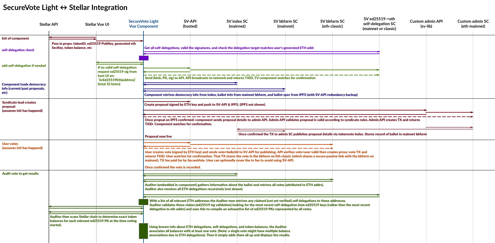

# Tokenvote to Stellar bridge - v1.0.1

This document describes v1.0.1 of how SecureVote Light (aka tokenvote) can integrate with Stellar chains and enable fee-free voting.
As part of this it assumes web integration via a Vue component. (Note: the component can be embedded in non-Vue UIs too, though it's not covered in this doc)

This doc particularly covers the Stellar-relevant parts:

* integration with host UI
* relationship between crypto keys
* linking ed25519 keys and ETH keys

Also note examples are in Typescript.

## Change Log

### v1.0.1 -> v1.0.2

* Updated the delegation header to `SV-ED-ETH` 
* Updated props required for the vue component

```
    :ioAdmin="ioAdmin"
    :debugMode="true"
    :stellarPk="stellarPk"
    :votingSk="votingSk"
    :democracyDetails="democracyDetails"
    :signResponse="signResponse"
@signRequestEvent="onSignRequest"
```

### v1.0 -> v1.0.1

* Changed 12 byte header to 8 byte header + nonce to allow delegating to the same Eth address multiple times (otherwise a delegation would only be able to made once)
* Changed signature request event such that `rawDataToSign` now contains all 32 bytes and the host app should check the header instead of adding it themselves

## System Schematic

Legend:
* Solid arrows show data flow direction. The data itself is unlabeled but the accompanying description alongside a set of arrow includes all information needed to deduce what data flows where.
* Dashed arrows indicate awaiting a confirmation.
* Dotted arrows indicate internal Ethereum transactions.
* The solid boxes  (e.g. at the end of the auditor sequence) indicates *potentially* (but not always) intensive computation.

[](../img/tokenvote-stellar-schematic.png)

## Terms

* SK: Secret Key
* PK: Public Key

## Cryptographic Setup

Due to the constraints and architecture of SecureVote Light it is preferable for voting to be conducted directly with Ethereum keys. While there are a number of advantages to this, we won't go into them here.

The main concern with regards to integration between SV Light and platforms that don't natively use Ethereum cryptosystems (keys, elliptic-curves, addresses, smart contracts, etc) is linking the ed25519 PK to an ETH PK. After that things are pretty standard.

The idea we have currently is to deterministically generate a new secret key from the user's existing ed25519 secret key. We do this in a similar way to [SQRL](https://www.grc.com/sqrl/sqrl.htm) (which is a fantastic authentication technology if you're unaware of it) - via an HMAC.

Essentially:

```typescript
const crypto = require('crypto')

const genEthHexSK = (stellarSK: Uint8Array, someConst: String): EthHex => {
    return "0x" + crypto.createHmac('sha256', stellarSK)
            .update(someConst)
            .digest('hex')
}

const votingEthSK = genEthHexSK(userSK.toHex(), "StellarToEthViaHMACOrSomething")
```

In this way we can securely *and deterministically* generate a new secret key for Stellar users that can not be used to compromise the user's stellar SK.

## Linking the keys

Linking the keys is fairly straight forward. We call this process *self-delegation* because voters are (in essence) delegating to themselves.

Users produce and publish (or have someone else publish) something like the following:

```typescript
// here `Bytes32` is some eth hex (0xa1b2...) representing 32 bytes
// format is [linkData, stellarPK, sig1, sig2]
type SelfDelegation = [Bytes32, Bytes32, Bytes32, Bytes32]

const toHex = x => someMagicFunctionBecauseJSHasNoSupportForCommonOperationsFacepalm(x)
const toEthHex = x => "0x" + toHex(x)

const toUi8a = str => new TextEncoder().encode(str)

// we use an 8 byte header + 4 byte nonce to pad the address
const SvEd25519SelfDlgtHeader = "SV-ED-ETH"

// generate the delegation tuple4
const genSelfDelegation = (ethAddr: EthHex, stellarSK: Uint8Array, stellarPK: Uint8Array): SelfDelegation => {
    // we add a nonce so we're able to create unique delegations to the same
    // address.
    const nonce = randomBytes(4)
    // note: we need to pad the address with some message to avoid potential
    // malicious signature requests (e.g. on a Stellar transaction).
    // note: this silly convoluted line concatenates two Uint8Arrays
    const linkData = Uint8Array.of(
            ...toUi8a(SvEd25519SelfDlgtHeader),
            ...toUi8a(nonce),
            ...web3.utils.hexToBytes(ethAddr)
        )
    assert(linkData.byteLength === 32)

    // if using nacl-js: https://github.com/tonyg/js-nacl#signatures-crypto_sign
    // note: signatures are 64b long
    const ed25519Signature = nacl.crypto_sign_detached(linkData, stellarSK)

    return [ linkData
           , stellarPK
           , ed25519Signature.slice(0,32)
           , ed25519Signature.slice(32,64)
           ].map(toEthHex)
}

const submitSelfDelegation = async (selfDelegation) => {
    // web3 1.0
    const sc = web3.eth.Contract(SELF_DLGT_ABI).at(SELF_DLGT_ADDR)
    return await sc.methods.submitSelfDelegation(...selfDelegation)
}

// make the delegation
submitSelfDelegation(genSelfDelegation(ethAddr, stellarSK, stellarPK))
    .then(onSuccess)
    .catch(onFail)
```

**Note:** because self-delegation submission can be done by an arbitrary party, in production SecureVote will likely publish self-delegations on behalf of voters via an API. The above code is just to demonstrate the process.

## Integration w/ UI

This is still a draft, but the Vue component will be used similarly to:

```vue
<template>
    <div>
        <SvLightVotingUI
            :ioAdmin="ioAdmin"
            :debugMode="true"
            :stellarPk="stellarPk"
            :votingSk="votingSk"
            :democracyDetails="democracyDetails"
            :signResponse="signResponse"
            @signRequestEvent="onSignRequest"
        />
    </div>
</template>

<script lang="ts">
// ... other imports and things ...
import { SvLightVotingUI, SvEd25519SelfDlgtHeader } from "sv-vue"

export default {
    // ...snip...
    data: () => ({
        signResponseMap: {},
    }),
    methods: {
        onSignRequest([signReqId, rawDataToSign]) {
            // it's important you verify the header yourself to ensure no-one can
            // exploit this event to (for example) sign a malicious transaction
            assert(toHex(rawDataToSign.slice(0,8)) === toHex(SvEd25519SelfDlgtHeader))
            this.signResponseMap[signReqId] = sign(rawDataToSign)
        }
    },
    // ...snip...
}
</script>
```

Signatures are obtained via Vue events with parameter: `[signReqId, rawDataToSign]`.
